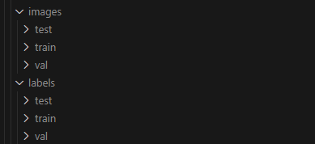
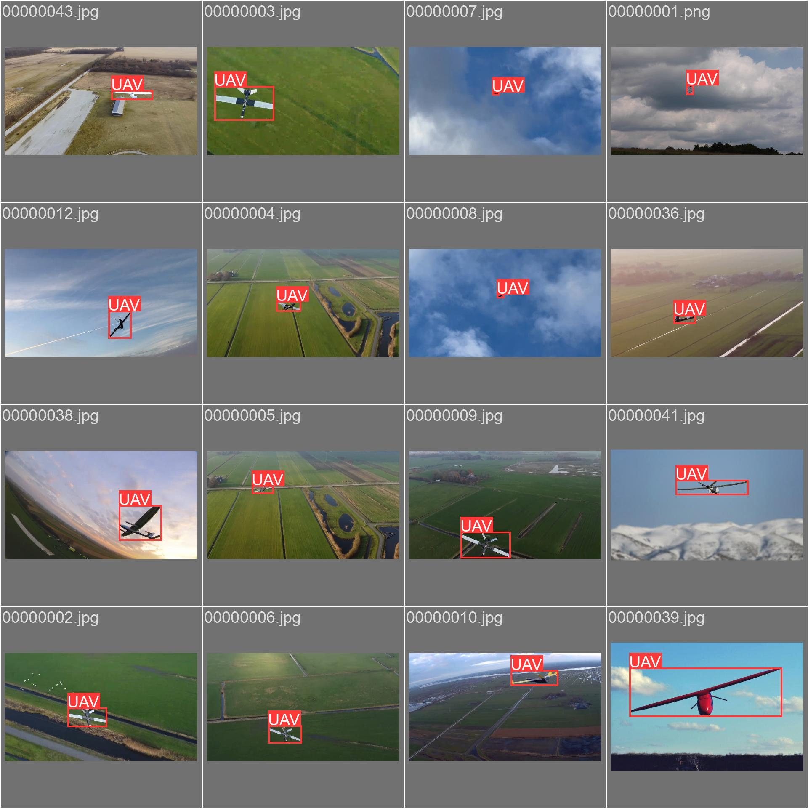
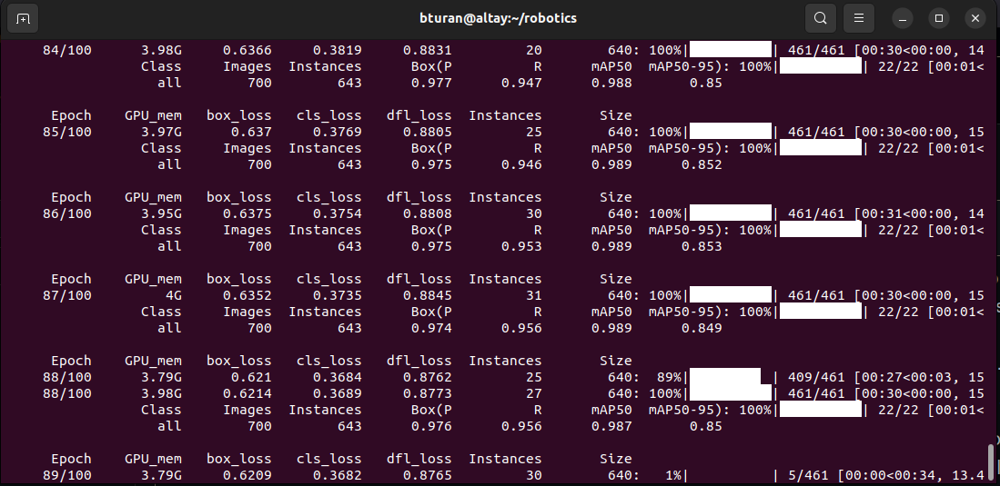

# Advanced UAV Combat Challenge

One Paragraph of project description goes here

### Contents:
- [Getting Started](#getting-started)
- [Custom Dataset Creation and Model Training with YOLOv8](#custom-dataset-creation-and-model-training-with-yolov8)
- [SITL with Flightgear Simulator](#sitl-with-flightgear-simulator)
- [Multi-Vehicle Simulation with FlightGear](#multi-vehicle-simulation-with-flightgear)

## Getting Started

These instructions will get you a copy of the project up and running on your local machine for development and testing purposes. See deployment for notes on how to deploy the project on a live system.

### Prerequisites

What things you need to install the software and how to install them


## Custom Dataset Creation and Model Training with YOLOv8

This guide walks you through creating a custom dataset, labeling the images, and training a YOLOv8 model.  
**(All the files used under this section are located in the `/train` directory.)**


### 1. Collecting Images
To create a custom dataset, you need to gather as many images as you want from internet sources (e.g., YouTube). The images should closely resemble scenarios that a UAV might encounter. You can achieve faster results by extracting frames from videos found on YouTube. I collected around 10,000 images and then increased this number using augmentation techniques.

### 2. Labeling Images
Use [CVAT.ai](https://cvat.ai/) to label your images. Proper labeling is crucial for the model to learn accurately.


### 3. Data Augmentation
Use data augmentation techniques to increase the diversity and size of your dataset. This helps improve the robustness of your model.

### 4. Preparing Data

- **train**: Used to train the model. This data helps the model learn patterns and relationships.
- **val**: Used to tune hyperparameters and assess the model’s performance during training. Helps prevent overfitting.
- **test**: Used for final evaluation after training. Provides an unbiased estimate of model performance on new, unseen data.

  
The `custom.yaml` file must point to the directories of the datasets you created. Make sure to update the paths in the file with the paths to your dataset. Additionally, you can configure the augmentation methods you want to use within this file. For example, you can specify different techniques such as flipping, scaling, and rotating to enhance your dataset. This configuration is crucial for ensuring that the training, validation, and test datasets are correctly referenced and that the data augmentation is properly applied.

Once you have completed the above steps, you can run the `yolov8Train.py` Python script. This script includes various configurations such as the model to be used, the GPUs that will be utilized, and the parameters the model will employ. You can adjust these settings according to your specific requirements. After configuring the script to your liking, you can execute it with the following command and wait for the model to be trained.

```sh
python3 yolov8Train.py
```
This will initiate the training process, during which the model will learn from the training data, validate using the validation data, and be evaluated against the test data. By carefully adjusting the script settings, you can optimize the performance of your model to suit your unique dataset and objectives.

<p float="left">
  
   
</p>


This project utilized [ITU UHeM](https://www.uhem.itu.edu.tr/) servers for training the model. Therefore, I would like to extend our deepest gratitude to the ITU UHeM authorities for their invaluable support. Their infrastructure played a crucial role in facilitating our research and development efforts, enabling us to effectively achieve our goals.


## SITL with Flightgear Simulator

First, you need to install and launch the FlightGear application:

1. Download and install FlightGear from the [official website](https://www.flightgear.org/download/)
2. Launch the application.

ArduPilot comes pre-configured with several airports. The locations of these airports can be found in the file:  
`..your_path/ardupilot/Tools/autotest/locations.txt`  

You can choose any of these airports and load it into FlightGear. If you want to use an airport that is not listed, you will need to add the necessary information to the `locations.txt` file.


For this project, we will use the airport code KSFO (San Francisco International Airport). First, we need to load this airport in FlightGear:

1. Open the FlightGear application.
2. Navigate to the `Airports` section and load KSFO (San Francisco International Airport).
3. After loading the airport, you can close the application.

Next, we need to modify the airport code in the configuration file:

1. Navigate to `..your_path/ardupilot/Tools/autotest/fg_plane_view.sh`
2. Open the file with a text editor (e.g., `nano` or `vim`).
3. Find the line with the airport code and change it to KSFO:
4. Save and close the file.
5. Run the `.sh` file to start FlightGear with the new airport code:
6. FlightGear will open and be ready for commands.

After setting up FlightGear, we need to start the SITL simulation:

1. Navigate to `..your_path/ardupilot/Tools/autotest/`
2. Run the following command to start the simulation:
    ```sh
    sim_vehicle.py -v ArduPlane --console --map -L KSFO
    ```
3. The simulation will start, and you will be able to send MAVLink commands.

To demonstrate, we will start a sample flight provided by ArduPilot:

1. Load the waypoints from a sample mission:
    ```sh
   wp load `..your_path`/ardupilot/Tools/autotest/Generic_Missions/CMAC-circuit.txt
    wp list
    mode auto
    arm throttle

After these commands, the simulation will start, and you can proceed with the flight.


## Multi-Vehicle Simulation with FlightGear


## License

This project is licensed under the MIT License - see the [LICENSE.md](LICENSE.md) file for details

## Acknowledgments

* Hat tip to anyone whose code was used
* Inspiration
* etc

